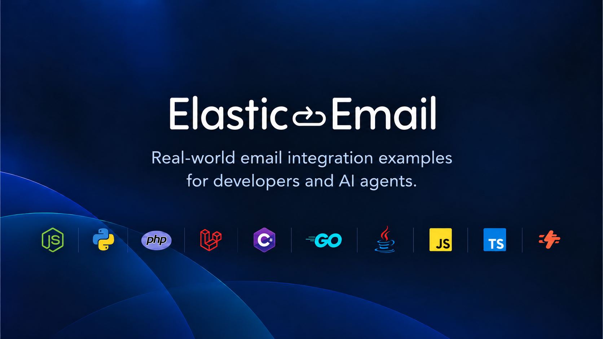

<p align="center">
  
</p>

<p align="center">
  <strong>Real-world examples for building with the Elastic Email API, SMTP, webhooks and AI coding agents.</strong>
</p>

<p align="center">
  <a href="#start-building">Quick Start</a>
  ·
  <a href="#send-with-smtp">SMTP</a>
  ·
  <a href="#using-with-ai-agents">AI Agents</a>
  ·
  <a href="https://elasticemail.com/developers/api-documentation/rest-api">API Docs</a>
  ·
  <a href="https://app.elasticemail.com/marketing/settings/new/manage-api">Get an API Key</a>
  ·
  <a href="https://help.elasticemail.com/en/articles/4934400-how-to-verify-your-domain">Verify Your Domain</a>
</p>

<p align="center">
  <a href="https://github.com/ElasticEmail/elasticemail-examples/releases"></a>
  <a href="LICENSE.md"></a>
  <a href="https://github.com/ElasticEmail/elasticemail-examples/stargazers"></a>
  <a href="https://github.com/ElasticEmail/elasticemail-examples/issues"></a>
  <a href="#all-stacks"></a>
  <a href="https://elasticemail.com/developers/api-documentation/rest-api"></a>
  <a href="#using-with-ai-agents"></a>
</p>

Production-shaped code samples for the [Elastic Email](https://elasticemail.com/email-api) email API
and SMTP relay, in 24 languages, frameworks and serverless platforms. Every stack implements the same
use cases through the official SDKs and REST API v4, so what you learn in one maps directly to the
others.

```typescript
import {
  Configuration,
  EmailsApi,
} from "@elasticemail/elasticemail-client-ts-axios";

const emailsApi = new EmailsApi(
  new Configuration({
    apiKey: process.env.ELASTICEMAIL_API_KEY,
  })
);

await emailsApi.emailsTransactionalPost({
  Recipients: { To: ["you@yourdomain.com"] },
  Content: {
    From: process.env.EMAIL_FROM!, // must be on a domain verified in Elastic Email
    Subject: "Hello from Elastic Email",
    Body: [
      { ContentType: "HTML", Content: "<p>Hello!</p>" },
      { ContentType: "PlainText", Content: "Hello!" },
    ],
  },
});
```

## Start building

Pick your stack and send your first email in about five minutes.

| Stack | Quick start |
|---|---|
| Next.js | [Quick start](nextjs-elasticemail-examples/QUICKSTART.md) |
| Express | [Quick start](express-elasticemail-examples/QUICKSTART.md) |
| Python | [Quick start](python-elasticemail-examples/QUICKSTART.md) |
| PHP | [Quick start](php-elasticemail-examples/QUICKSTART.md) |
| Laravel | [Quick start](laravel-elasticemail-examples/QUICKSTART.md) |
| .NET | [Quick start](dotnet-elasticemail-examples/QUICKSTART.md) |
| Go | [Quick start](go-elasticemail-examples/QUICKSTART.md) |
| Java | [Quick start](java-elasticemail-examples/QUICKSTART.md) |

Something else? Ruby, Rust, Elixir, Kotlin, plain Node.js, NestJS, Fastify, Hono, Bun, the full-stack
JavaScript frameworks, serverless platforms, SMTP, email templates, AI agents and background jobs are
all in [All stacks](#all-stacks).

## What is included

- [Transactional and bulk email](#sending)
- [Templates and merge variables](docs/templates.md), plus [React Email and MJML](email-templates-elasticemail-examples/)
- [Attachments and inline images](docs/attachments.md)
- [Contacts and lists](#contacts-and-lists)
- [Webhooks](docs/webhooks.md)
- [Inbound email](docs/inbound-email.md)
- [SMTP examples](#send-with-smtp)
- [Serverless examples](serverless-elasticemail-examples/)
- [Background jobs with retries](queues-elasticemail-examples/): BullMQ, Inngest, Trigger.dev
- [Email tools for AI agents](ai-agents-elasticemail-examples/): Vercel AI SDK, LangChain, OpenAI Agents SDK
- [Claude Code and AI agent support](#using-with-ai-agents)
- [MCP integration](#using-with-ai-agents)

Every example runs on the free plan - see [plans and pricing](https://elasticemail.com/email-api-pricing).

## Using with AI agents

The repository includes support for Claude Code, agent skills, MCP and LLM-readable documentation.

```bash
npx skills add ElasticEmail/elasticemail-examples
```

These examples are laid out so a coding agent can find the right file and copy working code
into your project instead of guessing at the API.

| File | For |
|---|---|
| [`AGENTS.md`](AGENTS.md) | Agents working in this repo: layout, conventions, the webhook and sender-domain rules that are easy to get wrong. Claude Code reads it through [`CLAUDE.md`](CLAUDE.md). |
| [`skills/elasticemail/SKILL.md`](skills/elasticemail/SKILL.md) | An [Agent Skill](https://agentskills.io) that adds Elastic Email to an existing project: detect the stack, copy the matching example, set env vars. |
| [`examples.json`](examples.json) | Machine-readable map from each use case to its source files, for every stack. |
| [`llms.txt`](llms.txt) / [`llms-full.txt`](llms-full.txt) | Index of every guide and quickstart, and the same content in one file. |

**Install the skill in Claude Code:**

```bash
/plugin marketplace add ElasticEmail/elasticemail-examples
/plugin install elasticemail@elasticemail
```

For other agents that support skills, copy `skills/elasticemail/` into the agent's skills folder
(for example `.cursor/skills/` or `~/.codex/skills/`), or use the `npx skills add` command above.

**Give the agent API access with the [Elastic Email MCP server](https://elasticemail.com/mcp).**
It sends email and manages contacts, lists, segments, templates, domains, suppressions and campaigns.
It is hosted at `https://mcp.elasticemail.com`, nothing to install; it takes your API key in the
`X-Auth-Token` header:

```bash
# Claude Code
claude mcp add --transport http elasticemail https://mcp.elasticemail.com --header "X-Auth-Token: $ELASTICEMAIL_API_KEY"
```

```jsonc
// Cursor: ~/.cursor/mcp.json
{ "mcpServers": { "elasticemail": { "url": "https://mcp.elasticemail.com", "headers": { "X-Auth-Token": "<api key>" } } } }

// VS Code: .vscode/mcp.json
{ "servers": { "elasticemail": { "type": "http", "url": "https://mcp.elasticemail.com", "headers": { "X-Auth-Token": "<api key>" } } } }
```

The full tool list is at [elasticemail.com/mcp](https://elasticemail.com/mcp); setup docs are at
[elasticemail.com/developers/mcp](https://elasticemail.com/developers/mcp).

## All stacks

Each quickstart is five minutes from nothing to a delivered email; the folder it links to covers
every example and route for that language.

| Language | Five-minute quickstart | All examples | Frameworks |
|----------|-----------|---------|-----------|
| **Next.js** | [Send email with Next.js](nextjs-elasticemail-examples/QUICKSTART.md) | [TypeScript](nextjs-elasticemail-examples/typescript/) / [JavaScript](nextjs-elasticemail-examples/javascript/) | Next.js 15, React 19 |
| **PHP** | [Send email with PHP](php-elasticemail-examples/QUICKSTART.md) | [PHP examples](php-elasticemail-examples/) | Slim, Symfony |
| **Laravel** | [Send email with Laravel](laravel-elasticemail-examples/QUICKSTART.md) | [Laravel examples](laravel-elasticemail-examples/) | Laravel 11 |
| **Python** | [Send email with Python](python-elasticemail-examples/QUICKSTART.md) | [Python examples](python-elasticemail-examples/) | Flask, FastAPI, Django |
| **Ruby** | [Send email with Ruby](ruby-elasticemail-examples/QUICKSTART.md) | [Ruby examples](ruby-elasticemail-examples/) | Sinatra, Rails |
| **Go** | [Send email with Go](go-elasticemail-examples/QUICKSTART.md) | [Go examples](go-elasticemail-examples/) | Chi, Gin |
| **Java** | [Send email with Java](java-elasticemail-examples/QUICKSTART.md) | [Java examples](java-elasticemail-examples/) | Javalin, Spring Boot |
| **Kotlin** | [Send email with Kotlin](kotlin-elasticemail-examples/QUICKSTART.md) | [Kotlin examples](kotlin-elasticemail-examples/) | Ktor 3 |
| **.NET (C#)** | [Send email with .NET](dotnet-elasticemail-examples/QUICKSTART.md) | [.NET examples](dotnet-elasticemail-examples/) | ASP.NET Minimal APIs, ASP.NET MVC |
| **Rust** | [Send email with Rust](rust-elasticemail-examples/QUICKSTART.md) | [Rust examples](rust-elasticemail-examples/) | Axum |
| **Elixir** | [Send email with Elixir](elixir-elasticemail-examples/QUICKSTART.md) | [Elixir examples](elixir-elasticemail-examples/) | Phoenix |
| **Node.js** | [Send email with Node.js](nodejs-elasticemail-examples/QUICKSTART.md) | [Node.js examples](nodejs-elasticemail-examples/) | node:http, no framework |
| **Express** | [Send email with Express](express-elasticemail-examples/QUICKSTART.md) | [Express examples](express-elasticemail-examples/) | Express 5 |
| **NestJS** | [Send email with NestJS](nestjs-elasticemail-examples/QUICKSTART.md) | [NestJS examples](nestjs-elasticemail-examples/) (TypeScript) | NestJS 11 |
| **Fastify** | [Send email with Fastify](fastify-elasticemail-examples/QUICKSTART.md) | [Fastify examples](fastify-elasticemail-examples/) | Fastify 5 |
| **Hono** | [Send email with Hono](hono-elasticemail-examples/QUICKSTART.md) | [Hono examples](hono-elasticemail-examples/) | Hono |
| **Bun** | [Send email with Bun](bun-elasticemail-examples/QUICKSTART.md) | [Bun examples](bun-elasticemail-examples/) | Bun.serve() |
| **Remix** | [Send email with Remix](remix-elasticemail-examples/QUICKSTART.md) | [Remix examples](remix-elasticemail-examples/) | Remix 2 |
| **Nuxt** | [Send email with Nuxt](nuxt-elasticemail-examples/QUICKSTART.md) | [Nuxt examples](nuxt-elasticemail-examples/) | Nuxt 3 |
| **SvelteKit** | [Send email with SvelteKit](sveltekit-elasticemail-examples/QUICKSTART.md) | [SvelteKit examples](sveltekit-elasticemail-examples/) | SvelteKit 2 |
| **Astro** | [Send email with Astro](astro-elasticemail-examples/QUICKSTART.md) | [Astro examples](astro-elasticemail-examples/) | Astro 5 |
| **RedwoodJS** | [Send email with RedwoodJS](redwoodjs-elasticemail-examples/QUICKSTART.md) | [RedwoodJS examples](redwoodjs-elasticemail-examples/) | RedwoodJS 8 |
| **TanStack Start** | [Send email with TanStack Start](tanstack-elasticemail-examples/QUICKSTART.md) | [TanStack Start examples](tanstack-elasticemail-examples/) | TanStack Start |
| **Serverless** | [Send email from serverless](serverless-elasticemail-examples/QUICKSTART.md) | [All 12 platforms](serverless-elasticemail-examples/) | Cloudflare Workers, Vercel, Supabase Edge, AWS Lambda, Deno Deploy, Netlify, Railway, Encore, Firebase, Azure Functions, Cloud Run, Convex |
| **SMTP** | [Send your first email with SMTP](smtp-elasticemail-examples/QUICKSTART.md) | [All 28 integrations](smtp-elasticemail-examples/) | Auth0, Supabase, Keycloak, WordPress, Ghost, Strapi, GitLab, Grafana, n8n, Nodemailer, Laravel, Django, Rails and more |
| **Email templates** | [Send your first templated email](email-templates-elasticemail-examples/QUICKSTART.md) | [Template examples](email-templates-elasticemail-examples/) | React Email, MJML |
| **AI agents** | [Send your first email from an AI agent](ai-agents-elasticemail-examples/QUICKSTART.md) | [AI agent examples](ai-agents-elasticemail-examples/) | Vercel AI SDK, LangChain, OpenAI Agents SDK |
| **Background jobs** | [Send your first email from a background job](queues-elasticemail-examples/QUICKSTART.md) | [Queue examples](queues-elasticemail-examples/) | BullMQ, Inngest, Trigger.dev |

JavaScript and TypeScript stacks use [`@elasticemail/elasticemail-client-ts-axios`](https://github.com/ElasticEmail/elasticemail-ts-axios). Other languages use the matching [Elastic Email SDK](https://elasticemail.com/developers/api-libraries). Elixir calls the REST API directly with Req.
All stacks are pinned to the 4.2 SDK line and target REST API v4.

## Send with SMTP

Some tools only let you enter an SMTP server: Auth0, Supabase Auth, Keycloak, WordPress, Ghost, Grafana. Some apps
already send through their framework's mailer. For both, [`smtp-elasticemail-examples/`](smtp-elasticemail-examples/)
shows how to point them at `smtp.elasticemail.com`, with no SDK involved. The
[SMTP quickstart](smtp-elasticemail-examples/QUICKSTART.md) sends a first message with `curl`.

| Platforms | Code |
|---|---|
| **Auth:** [Auth0](smtp-elasticemail-examples/auth0/), [Supabase](smtp-elasticemail-examples/supabase/), [Keycloak](smtp-elasticemail-examples/keycloak/), [Firebase Auth](smtp-elasticemail-examples/firebase-auth/), [Appwrite](smtp-elasticemail-examples/appwrite/), [PocketBase](smtp-elasticemail-examples/pocketbase/)<br>**CMS:** [WordPress](smtp-elasticemail-examples/wordpress/), [Ghost](smtp-elasticemail-examples/ghost/), [Strapi](smtp-elasticemail-examples/strapi/), [Directus](smtp-elasticemail-examples/directus/), [Payload](smtp-elasticemail-examples/payload/), [Liferay](smtp-elasticemail-examples/liferay/)<br>**Self-hosted:** [GitLab](smtp-elasticemail-examples/gitlab/), [Grafana](smtp-elasticemail-examples/grafana/), [Nextcloud](smtp-elasticemail-examples/nextcloud/), [Discourse](smtp-elasticemail-examples/discourse/), [Metabase](smtp-elasticemail-examples/metabase/), [Retool](smtp-elasticemail-examples/retool/)<br>**Automation:** [n8n](smtp-elasticemail-examples/n8n/), [Zapier](smtp-elasticemail-examples/zapier/), [Customer.io](smtp-elasticemail-examples/customer-io/) | [Node.js](smtp-elasticemail-examples/nodejs/), [Nodemailer](smtp-elasticemail-examples/nodemailer/), [NextAuth](smtp-elasticemail-examples/nextauth/), [PHPMailer](smtp-elasticemail-examples/phpmailer/), [Laravel](smtp-elasticemail-examples/laravel/), [Django](smtp-elasticemail-examples/django/), [Rails](smtp-elasticemail-examples/rails/) |

SMTP uses its own credentials (Settings > SMTP in the dashboard), not the API key.

## Examples Included

Every language and framework stack covers the sending, webhook, inbound, contacts, double opt-in and
domain examples. The full-stack framework apps (Next.js, Remix, Nuxt, SvelteKit, Astro, RedwoodJS,
TanStack Start, Laravel) skip some account-level ones, and the serverless folders focus on send and webhooks.
[`examples.json`](examples.json) lists exactly which files cover which use case in each stack.

### Sending
- **Basic Send** - HTML and plain text transactional email
- **Batch Send** - One bulk call with per-recipient merge fields
- **With Attachments** - Base64 file attachments
- **With CID Attachments** - Inline images referenced by Content-ID
- **With Templates** - Hosted templates with merge variables (created on first run)
- **Scheduled Send** - Delayed delivery with `TimeOffset`
- **Prevent Threading** - Unique `X-Entity-Ref-ID` header per message
- **Email Status** - Look up a transaction and view a sent message

### Receiving
- **Webhooks** - Create webhooks and handle Sent, Opened, Clicked, Error, AbuseReport and Unsubscribed events
- **Inbound** - Inbound routes that push parsed email to your endpoint

### Contacts and lists
- **Contacts** - Lists, contact CRUD, custom fields
- **Double Opt-in** - Confirmation link with an HMAC token, or confirmation through the Clicked event
- **Suppressions** - Unsubscribe, bounce and complaint lists

### Account
- **Domains** - Add a sending domain and read SPF, DKIM, MX, DMARC and tracking status
- **Statistics** - Account-level delivery statistics
- **Email Verification** - Single address verification
- **Sub-accounts** - List sub-accounts, and optionally create one and assign credits

## Guides

Language-neutral explanations of the concepts every example uses. Start with the quickstart for your
stack, come here when you need the detail.

| Guide | What it covers |
|---|---|
| [Environment variables](docs/environment-variables.md) | Every variable, where it is used, what breaks without it |
| [Sending email](docs/sending-email.md) | Transactional vs bulk, merge fields, scheduling, threading, delivery lookup |
| [Attachments](docs/attachments.md) | File attachments and inline (CID) images |
| [Templates](docs/templates.md) | Hosted templates, merge values, creating one from code |
| [Contacts and lists](docs/contacts-and-lists.md) | Lists, contact CRUD, statuses, custom fields |
| [Double opt-in](docs/double-opt-in.md) | Both confirmation flows, and when to pick which |
| [Webhooks](docs/webhooks.md) | Events, their parameters, the token scheme, handler design |
| [Inbound email](docs/inbound-email.md) | Routes, MX setup, the parsed fields you receive |
| [Suppressions](docs/suppressions.md) | Unsubscribes, bounces, complaints |
| [Domains and deliverability](docs/domains-and-deliverability.md) | SPF, DKIM, MX, DMARC, tracking, warm-up |
| [Account](docs/account.md) | Statistics, email verification, sub-accounts |
| [Error handling](docs/error-handling.md) | The error body, and how each SDK surfaces it |
| [API map](docs/api-map.md) | Use case to SDK method, in every language here |
| [Troubleshooting](docs/troubleshooting.md) | Symptom to cause, for the failures that actually happen |

## Getting Started

1. **Get an API key** from [app.elasticemail.com](https://app.elasticemail.com/marketing/settings/new/manage-api).
   Copy it straight away - it is shown once. [API settings](https://help.elasticemail.com/en/articles/4799160-api-settings) covers creating and managing keys.

2. **Verify a sender domain** in the Elastic Email dashboard. Examples send from `EMAIL_FROM`, which must belong to a verified domain.
   Publishing the SPF and DKIM records takes a few minutes - [How to verify your domain](https://help.elasticemail.com/en/articles/4934400-how-to-verify-your-domain) walks through it.

3. **Clone this repository**:
   ```bash
   git clone https://github.com/ElasticEmail/elasticemail-examples.git
   ```

4. **Choose your stack** and follow its README

5. **Copy `.env.example` to `.env`** and fill in `ELASTICEMAIL_API_KEY`, `EMAIL_FROM` and `EMAIL_TO`

6. **Run the examples**

## Notes on webhooks and inbound

Elastic Email does not sign webhook requests. Every example appends a shared secret to the callback URL
(`?token=ELASTICEMAIL_WEBHOOK_TOKEN`) and verifies it with a constant-time compare. Elastic Email sends each event
as a GET request with the details in the query string (`status`, `to`, `transaction`, `messageid`, `category`,
`target`). Inbound email is different: it arrives as a POST with form fields (`from_email`, `subject`,
`body_text`, `body_html`, `att1_name`, `att1_content`, ...).

When you save a webhook, Elastic Email sends one test event to the URL and saves the webhook only if it gets a
2xx response, so the URL has to be publicly reachable at that moment. During local development, run a tunnel
such as ngrok and set `PUBLIC_URL` accordingly. The test event carries sample values (`to=test@test.com`,
`messageid=abc1234`). The handlers accept it like any other event; in your own app, skip it before it reaches
your data.

Full detail: [Webhooks](docs/webhooks.md) and [Inbound email](docs/inbound-email.md).

## Resources

- [Elastic Email email API](https://elasticemail.com/email-api) - REST API and SMTP relay overview, features and plans
- [Elastic Email Developers](https://elasticemail.com/developers)
- [REST API Reference](https://elasticemail.com/developers/api-documentation/rest-api)
- [API Libraries](https://elasticemail.com/developers/api-libraries)
- [Elastic Email CLI](https://github.com/ElasticEmail/elasticemail-cli)
- [Elastic Email MCP server](https://elasticemail.com/developers/mcp)
- [Dashboard](https://app.elasticemail.com)

## Contributing

Found a problem or want to add a stack? [Open an issue](https://github.com/ElasticEmail/elasticemail-examples/issues) or send a pull request.
[CONTRIBUTING.md](CONTRIBUTING.md) covers the conventions and how to add a stack. To report a security
issue, see [SECURITY.md](SECURITY.md).

## License

MIT
